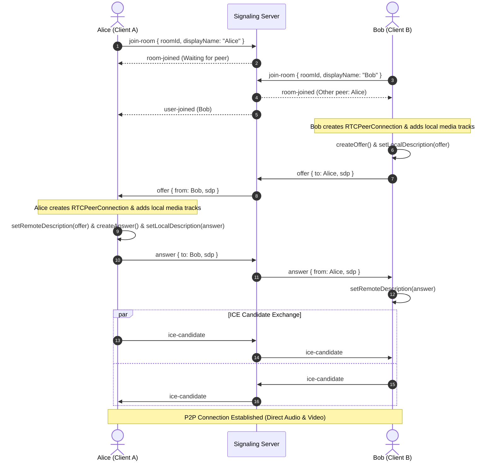

# StreamCall - Modern Web-Based Audio and Video Calling System

A fast, modern, and privacy-focused browser-based multi-party audio, video, screen share, and instant chat calling application built from scratch with native WebRTC, Socket.IO, React, Vite, TypeScript, and Node.js.

---

## 1. Project Overview

StreamCall provides a seamless peer-to-peer calling experience directly inside any modern web browser without requiring third-party calling SDKs (like Twilio or Agora) or account registrations.

- **Direct P2P Media Streams**: Audio and video flow directly between peers using browser-native WebRTC APIs (`RTCPeerConnection`).
- **Low-Latency Signaling**: Room coordination, SDP offer/answer exchanges, and ICE candidate negotiation are handled via a lightweight Socket.IO server.
- **Multi-Party Mesh Calling**: Supports up to 10 simultaneous participants in a single room with dynamic grid layout and participant spotlighting. Attempts to join beyond 10 participants are gracefully rejected (`room-full`).
- **Rich Collaboration Suite**: Built-in screen sharing (`getDisplayMedia`), instant in-call text chat, floating emoji reactions, device test previews, and automated invite links.
- **Responsive & Modern UI**: Built with React, Tailwind CSS, and Lucide icons featuring glassmorphism, responsive video layouts, and device permission handling.

---

## 2. Architecture & WebRTC Flow

### Architecture Diagram

```mermaid
graph TD
    ClientA["Client A (Browser)"] <-->|Signaling Events (WebSocket)| Server["Signaling Server (Node/Express/Socket.IO)"]
    ClientB["Client B (Browser)"] <-->|Signaling Events (WebSocket)| Server
    ClientA <===>|WebRTC Peer-to-Peer (SRTP Media + ICE)| ClientB
```

### WebRTC Signaling Sequence



---

## 3. Technology Stack

### Frontend (`/client`)
- **React 18**: UI component rendering and reactive state.
- **TypeScript**: Static typing across all components, hooks, and services.
- **Vite 6**: Fast bundler and development server.
- **Tailwind CSS**: Utility-first CSS styling with glassmorphism effects and custom animations.
- **Lucide React**: Clean icons for mic, camera, leave call, and room actions.
- **Socket.IO Client**: Real-time signaling communication.

### Backend (`/server`)
- **Node.js**: Server runtime.
- **Express**: REST endpoints for health checks and room status.
- **Socket.IO**: Real-time bidirectional event-based signaling.
- **TypeScript / tsx**: Type-safe development and execution.

### Media & Connectivity
- **WebRTC APIs**: `RTCPeerConnection`, `MediaDevices.getUserMedia()`, `RTCSessionDescription`, `RTCIceCandidate`.
- **STUN Server**: Public Google STUN server (`stun:stun.l.google.com:19302`).

---

## 4. Folder Structure

```
calling_System/
├── client/                     # Frontend React + Vite application
│   ├── public/                 # Static assets
│   ├── src/
│   │   ├── components/         # Modular React components
│   │   │   ├── CallControls.tsx    # Bottom dock (Mute mic, camera, screen share, chat, reactions, leave)
│   │   │   ├── CallTimer.tsx       # Real-time call duration timer
│   │   │   ├── ConnectionStatus.tsx# Status banners & warning pills
│   │   │   ├── FloatingReactions.tsx# Real-time floating animated emoji layer
│   │   │   ├── InCallChat.tsx      # Sidebar slide-out live text chat
│   │   │   ├── InviteModal.tsx     # Copy link & native sharing modal
│   │   │   ├── RoomForm.tsx        # Landing screen with pre-call device preview
│   │   │   ├── VideoGrid.tsx       # Multi-party dynamic grid layout & spotlight
│   │   │   └── VideoPlayer.tsx     # Video feed renderer & fallback avatar initials
│   │   ├── hooks/
│   │   │   └── useWebRTC.ts    # WebRTC lifecycle & state orchestration
│   │   ├── services/
│   │   │   ├── socket.ts       # Socket.IO client instance
│   │   │   └── webrtc.ts       # RTCPeerConnection & media device helpers
│   │   ├── types/
│   │   │   └── index.ts        # Frontend type definitions
│   │   ├── App.tsx             # Root UI state switcher
│   │   ├── main.tsx            # React application entry point
│   │   └── index.css           # Tailwind directives and custom styles
│   ├── index.html
│   ├── package.json
│   ├── tailwind.config.js
│   ├── tsconfig.json
│   └── vite.config.ts
├── server/                     # Backend Signaling Server
│   ├── src/
│   │   ├── index.ts            # Express + Socket.IO server entry
│   │   ├── roomManager.ts      # In-memory room & participant state manager
│   │   ├── socketHandlers.ts   # Signaling event dispatchers
│   │   └── types.ts            # Server-side TypeScript interfaces
│   ├── package.json
│   └── tsconfig.json
├── .env.example                # Environment variables template
├── .gitignore                  # Git exclusions
├── package.json                # Root package.json with workspaces & scripts
└── README.md                   # Complete documentation
```

---

## 5. Installation & Setup

### Prerequisites
- Node.js version 18.0.0 or later (tested on Node v22.x)
- npm version 9.0.0 or later

### Install Dependencies
Clone or open the repository, then install all root and workspace dependencies:

```bash
npm install
```

This single command installs root packages (`concurrently`) as well as all packages in `/server` and `/client`.

---

## 6. Environment Configuration

Copy the example environment file:

```bash
cp .env.example .env
```

Default variables:
```env
# Signaling Server Port
SERVER_PORT=5000
NODE_ENV=development

# Frontend Signaling Endpoint (Vite)
VITE_SIGNALING_SERVER_URL=http://localhost:5000
```

---

## 7. Running Locally

### Start Both Server & Client Concurrently
Run the root `dev` command:

```bash
npm run dev
```

This starts:
- **Signaling Server**: `http://localhost:5000` (Health check at `http://localhost:5000/api/health`)
- **Frontend App**: `http://localhost:5173`

### Run Individually (Optional)
To run the server only:
```bash
npm run dev:server
```

To run the client only:
```bash
npm run dev:client
```

---

## 8. How to Test a 1-to-1 Call

1. Open your browser and navigate to `http://localhost:5173`.
2. Enter your display name (e.g. `Alice`) and click **Create Room**.
3. Allow camera and microphone permissions when prompted by the browser (or test media preview before entering).
4. You will enter the room waiting screen showing your local video preview and the generated Room ID.
5. Click **Invite** (or **Copy Room ID**) to copy the automated invite link or open the invite modal.
6. Open a **second browser tab** (or another browser / device) and navigate to the room link.
7. Enter a different name (e.g. `Bob`) and click **Join Room**.
8. Both participants will instantly connect:
   - Alice will see Bob's live video and hear Bob's audio.
   - Bob will see Alice's live video and hear Alice's audio.
9. **Invite Additional Participants (Up to 10)**:
   - Open a third or fourth tab (e.g. `Charlie`, `Diana`) and join the same room.
   - StreamCall automatically arranges participants into a responsive grid with individual spotlighting.
10. **Test In-Call Features**:
   - **Microphone**: Click the Mic button to mute/unmute (instantly syncs red muted badge across all peers).
   - **Camera**: Click the Camera button to turn video on/off (smoothly falls back to user avatar with initials).
   - **Screen Share**: Click Share Screen to broadcast your desktop or window to all room members.
   - **Chat**: Click Chat to open the slide-out in-call messaging drawer with real-time delivery and unread count badge.
   - **Reactions**: Click the Smile icon to broadcast animated floating emoji reactions that float up for all peers.
   - **Fullscreen**: Click the Fullscreen icon for an immersive call view.
   - **Leave Call**: Click Leave Call to exit the call and cleanly notify peers.
11. **Test Room Full**: When 10 participants are connected, any 11th participant attempting to join is cleanly rejected with the error: `"Room is already full (maximum 10 participants)"`.

### Automated End-to-End Tests

To execute the automated multi-browser WebRTC E2E validation:

```bash
npm run test:webrtc
```

This launches multi-browser contexts with simulated media devices and validates all 27 automated checks:
- Real `RTCPeerConnection` reaching `connected` state across peers
- Bidirectional live audio and video track streaming
- In-call controls (Mic and Camera mute/unmute) with cross-peer icon state synchronization
- In-call text chat messaging and unread notification badge
- Floating emoji reactions rendering
- Multi-party mesh calling and participant counter (`3 / 10`)
- Dynamic video grid viewports and participant spotlight
- Room capacity rejection (`room-full`)
- Leave call, peer disconnect detection, and room rejoin
- Fullscreen and responsive viewport adaptation

To run the multi-party signaling and capacity integration test:
```bash
npm run test:signaling
```

---

## 9. LAN Testing (Local Network & Real Devices)

StreamCall is configured to bind to `0.0.0.0`, allowing devices connected to the same Wi-Fi or local area network (LAN) to test 1-to-1 calls on real hardware (laptops, phones, tablets) without deploying to the cloud.

### 9.1 Network Requirements & Topology

```text
       ┌──────────────────────────────────────────────┐
       │             Same Local Wi-Fi / LAN           │
       └──────────────────────┬───────────────────────┘
                              │
              ┌───────────────┴───────────────┐
              ▼                               ▼
     [Development PC]                 [Second Device]
   Runs Frontend & Backend            Laptop / Phone
   Local: http://localhost:5173       LAN: http://<LAN_IP>:5173
   LAN:   http://<LAN_IP>:5173
```

- **Same Network**: Both devices must be connected to the same local Wi-Fi router or subnet.
- **Port 5173 (TCP)**: Vite frontend development server.
- **Port 5000 (TCP)**: Socket.IO signaling & Express REST API server.

### 9.2 Determining the Host Machine LAN IP

When you start the development server, the actual LAN IP is automatically detected and displayed in the terminal:

```text
=========================================
StreamCall Development Server

Local:
  http://localhost:5173

LAN:
  http://192.168.1.124:5173

Backend:
  Local: http://localhost:5000
  LAN:   http://192.168.1.124:5000
  Health: http://localhost:5000/api/health
=========================================
```

Alternatively, you can determine your LAN IP manually:
- **Windows**: Run `ipconfig` in PowerShell / Command Prompt and look for the IPv4 Address under your active Wi-Fi or Ethernet adapter (e.g. `192.168.x.x` or `10.x.x.x`).
- **macOS / Linux**: Run `ifconfig` or `ip addr show`.

### 9.3 Windows Firewall Configuration

By default, Windows Firewall may block incoming connections from other devices on your LAN.

> [!NOTE]
> Do NOT disable the Windows Firewall. Allow only the required application ports on the **Private** network profile.

To allow other devices to connect, open PowerShell **as Administrator** and execute:

```powershell
# Allow Vite Frontend (Port 5173) on Private networks
New-NetFirewallRule -DisplayName "StreamCall Vite Frontend (5173)" -Direction Inbound -LocalPort 5173 -Protocol TCP -Action Allow -Profile Private

# Allow Signaling Server (Port 5000) on Private networks
New-NetFirewallRule -DisplayName "StreamCall Signaling Server (5000)" -Direction Inbound -LocalPort 5000 -Protocol TCP -Action Allow -Profile Private
```

To remove these rules when testing is complete:

```powershell
Remove-NetFirewallRule -DisplayName "StreamCall Vite Frontend (5173)"
Remove-NetFirewallRule -DisplayName "StreamCall Signaling Server (5000)"
```

### 9.4 Step-by-Step Testing Procedure

1. **Connect both devices** to the same Wi-Fi router.
2. **Start StreamCall with HTTPS (Recommended for Camera & Mic permissions)**:
   ```bash
   npm run dev:https
   ```
   *(Or run plain HTTP via `npm run dev`)*
3. **Open Device A** (Development PC):
   Navigate to `https://localhost:5173` (or `https://192.168.1.131:5173`).
4. **Create a Room** on Device A:
   Enter your name (e.g., `Alice`), click **Create Room**, and copy the room link or Room ID.
5. **Open Device B** (Phone or second laptop):
   Open a browser (Chrome, Safari, Edge, Firefox) and navigate to:
   ```text
   https://192.168.1.131:5173
   ```
6. **Bypass Development Certificate Warning on Device B**:
   - Because `@vitejs/plugin-basic-ssl` uses a self-signed dev certificate, the browser will display a security warning (*"Your connection isn't private"*).
   - Tap **"Advanced"** -> Tap **"Proceed to 192.168.1.131 (unsafe)"**.
7. **Allow Camera & Microphone Permissions**:
   - Because the session is served over HTTPS, the browser runs in a **Secure Context**.
   - Tap **"Allow / Test Camera & Mic"** or enter your name and tap **"Join Call"**.
   - The native browser dialog will appear asking to allow camera & microphone access. Tap **"Allow"**.
8. **Verify 1-to-1 WebRTC Call**:
   - Both devices connect via Socket.IO through Vite's reverse proxy.
   - P2P WebRTC negotiation establishes a direct connection.
   - Both devices stream bidirectional live audio and video.
   - Test microphone mute/unmute and camera toggling.
   - Leave call and test room rejoin.
   - Verify that a 3rd device attempting to join receives the `"Room is already full"` notice.

### 9.5 Browser Security & Real-Device Modes (HTTP vs HTTPS)

> [!IMPORTANT]
> **Why camera / microphone access requires HTTPS on LAN:**
> The W3C WebRTC specification mandates that `navigator.mediaDevices.getUserMedia` is only available in **Secure Contexts** (`isSecureContext === true`).
> - **Localhost (`http://localhost`)**: Treated by all modern browsers as a secure context for development. Camera and microphone work out of the box.
> - **LAN HTTPS (`https://<LAN_IP>:5173` via `npm run dev:https`)**: Provides a Secure Context on external devices! Camera and microphone work natively after accepting the self-signed certificate.
> - **LAN HTTP (`http://<LAN_IP>:5173`)**: Treated as an **insecure context** on external devices. Browsers completely disable `getUserMedia()` unless `chrome://flags/#unsafely-treat-insecure-origin-as-secure` is manually enabled on Chromium browsers.

#### Browser Behavior Matrix:

| Platform / Browser | Mode | Socket.IO & UI | WebRTC Call | Camera & Mic Access | Action Required |
|---|---|---|---|---|---|
| **Host PC (localhost)** | HTTP or HTTPS | Supported | Supported | Supported | None needed |
| **Mobile / Second Laptop** | `npm run dev:https` | Supported | Supported | Supported | Tap "Advanced" -> "Proceed" |
| **Android Chrome** | `npm run dev` (HTTP) | Supported | Supported | Blocked by default | Enable `chrome://flags/#unsafely-treat-insecure-origin-as-secure` |
| **iOS Safari** | `npm run dev` (HTTP) | Supported | Supported | Blocked | Use `npm run dev:https` |
| **Desktop Firefox (LAN PC)** | Supported | Supported | Blocked by default | Configure `media.devices.insecure.enabled` in `about:config` |

#### How to Enable Camera/Mic on Android Chrome for LAN Testing:
1. On your Android phone, open Chrome and enter:
   ```text
   chrome://flags/#unsafely-treat-insecure-origin-as-secure
   ```
2. Enable the flag.
3. In the text area below the flag, add your LAN frontend origin:
   ```text
   http://192.168.1.124:5173
   ```
4. Tap **Relaunch** at the bottom of the screen.
5. Reopen `http://192.168.1.124:5173` — camera and microphone permissions can now be granted.

*Note: StreamCall includes graceful permission handling. If camera/mic is blocked due to an insecure context, the UI displays a helpful notice rather than crashing.*

### 9.6 Automated LAN Verification

You can verify that all LAN network bindings, CORS headers, health checks, and Socket.IO signaling over your LAN interface are working with:

```bash
npm run test:lan
```

---

## 10. Socket.IO Signaling Events Reference

| Event Name | Direction | Payload | Description |
|---|---|---|---|
| `join-room` | Client -> Server | `{ roomId, displayName, isAudioMuted, isVideoMuted }` | Request to enter room. |
| `room-joined` | Server -> Client | `{ roomId, self, otherParticipants }` | Confirms room membership with list of existing peers. |
| `user-joined` | Server -> Client | `{ participant }` | Notifies existing peers that a new user joined. |
| `offer` | Bidirectional | `{ to, sdp }` / `{ from, senderName, sdp }` | Relays WebRTC SDP offer. |
| `answer` | Bidirectional | `{ to, sdp }` / `{ from, sdp }` | Relays WebRTC SDP answer. |
| `ice-candidate` | Bidirectional | `{ to, candidate }` / `{ from, candidate }` | Relays ICE candidate for NAT traversal. |
| `media-toggle` | Client -> Server | `{ type: 'audio' \| 'video', isMuted }` | Sends mic or camera toggle to server. |
| `peer-media-toggled` | Server -> Client | `{ socketId, type, isMuted }` | Broadcasts peer mic/cam mute state to room. |
| `chat-message` | Bidirectional | `{ text }` / `{ id, senderId, senderName, text, timestamp }` | Dispatches in-call chat message to room participants. |
| `call-reaction` | Bidirectional | `{ emoji }` / `{ id, senderId, senderName, emoji, timestamp }` | Broadcasts floating emoji reaction to room participants. |
| `leave-room` | Client -> Server | (none) | User intentionally leaves call. |
| `user-left` | Server -> Client | `{ socketId, displayName, reason }` | Informs peers that a user left the room. |
| `room-full` | Server -> Client | `{ success: false, reason: 'room_full', message }` | Sent when an 11th user attempts to join a full room. |

---

---

## 11. Android Native Application

StreamCall includes a complete, production-grade Android application built with **Capacitor** and native Android Java/Gradle bindings, located in the `android/` directory.

### Features
- **100% Feature Parity**: Multi-party WebRTC video/audio calls, chat, reactions, call recordings, and lobby settings.
- **Hardware Permission Bridge**: Custom `WebChromeClient.onPermissionRequest` in `MainActivity.java` automatically grants camera and microphone hardware feeds to the WebRTC WebView.
- **Dynamic Server Discovery & Settings**: Auto-detects the backend server or allows users to switch to any LAN or production URL via the in-app gear ⚙️ icon.
- **Cleartext Security**: Configured with `network_security_config.xml` to allow testing across local Wi-Fi IPs (`192.168.*`, `10.*`).

### Building and Running the Android App

#### 1. Compile the APK (One Command)
```bash
npm run android:apk
```
This builds the client, syncs native assets, and compiles the debug APK directly to the root directory as **`StreamCall.apk`** (also at `android/app/build/outputs/apk/debug/app-debug.apk`).

#### 2. Install on Your Phone
- **Direct Transfer**: Send `StreamCall.apk` to your phone (WhatsApp, Google Drive, USB) and tap **Install**.
- **ADB Command**: With your phone connected via USB (USB Debugging enabled):
  ```powershell
  adb install -r StreamCall.apk
  ```

#### 3. Open in Android Studio
```bash
npm run android:open
```

---

## 12. Production Deployment & Global Access Guide

To allow users worldwide to call each other over the public internet, deploy StreamCall with **HTTPS/WSS** and **STUN/TURN** servers.

### 12.1 Option A: Docker Compose (Recommended - Quickest)

The repository includes a production multi-stage `Dockerfile` and `docker-compose.yml`.

1. Clone the repository on your server:
   ```bash
   git clone https://github.com/ommnnitald/calling_System.git
   cd calling_System
   ```
2. Copy and configure the environment variables:
   ```bash
   cp .env.example .env
   # Edit JWT_SECRET and domain name in .env
   nano .env
   ```
3. Start the application and MongoDB in the background:
   ```bash
   docker compose up -d --build
   ```
4. Check service status:
   ```bash
   docker compose ps
   docker compose logs -f streamcall
   ```
The app will be running on port `5000` with the frontend SPA, API, WebSockets, and MongoDB database fully connected.

---

### 12.2 Option B: Ubuntu/Debian VPS with Nginx & Let's Encrypt SSL

For a production domain (e.g. `call.yourdomain.com`):

#### 1. Install Node.js, MongoDB & Nginx
```bash
# Install Node.js 20
curl -fsSL https://deb.nodesource.com/setup_20.x | sudo -E bash -
sudo apt-get install -y nodejs nginx certbot python3-certbot-nginx

# Install & start MongoDB
sudo apt-get install -y gnupg curl
curl -fsSL https://www.mongodb.org/static/pgp/server-7.0.asc | sudo gpg -o /usr/share/keyrings/mongodb-server-7.0.gpg --dearmor
echo "deb [ arch=amd64,arm64 signed-by=/usr/share/keyrings/mongodb-server-7.0.gpg ] https://repo.mongodb.org/apt/ubuntu $(lsb_release -cs)/mongodb-org/7.0 multiverse" | sudo tee /etc/apt/sources.list.d/mongodb-org-7.0.list
sudo apt-get update && sudo apt-get install -y mongodb-org
sudo systemctl enable --now mongod
```

#### 2. Build the Application
```bash
git clone https://github.com/ommnnitald/calling_System.git /var/www/streamcall
cd /var/www/streamcall
npm install
npm run build
```

#### 3. Run with PM2 Process Manager
```bash
sudo npm install -g pm2
pm2 start server/dist/index.js --name streamcall --env NODE_ENV=production,SERVE_CLIENT=true,PORT=5000
pm2 save
pm2 startup
```

#### 4. Configure Nginx Reverse Proxy
Copy the provided template:
```bash
sudo cp nginx.conf.example /etc/nginx/sites-available/streamcall
sudo nano /etc/nginx/sites-available/streamcall # Replace yourdomain.com with your actual domain
sudo ln -s /etc/nginx/sites-available/streamcall /etc/nginx/sites-enabled/
sudo nginx -t && sudo systemctl reload nginx
```

#### 5. Obtain Free SSL Certificate
```bash
sudo certbot --nginx -d call.yourdomain.com
```

---

### 12.3 WebRTC Global NAT Traversal: Setting Up TURN

While local Wi-Fi calling connects directly peer-to-peer, participants on **cellular 4G/5G networks** or strict corporate Wi-Fi require a **TURN relay server** to bridge symmetric NATs.

StreamCall supports turn server configuration via environment variables:

```bash
# In your .env or server environment:
VITE_TURN_SERVER_URL=turn:turn.yourdomain.com:3478
VITE_TURN_USERNAME=myuser
VITE_TURN_CREDENTIAL=mypassword
```

#### Free & Managed TURN Providers
- **Metered.ca**: Offers 50 GB free monthly TURN relay bandwidth.
- **OpenRelay (Metered)**: Public STUN/TURN relays.
- **Self-hosted Coturn**:
  ```bash
  sudo apt-get install coturn
  # Configure /etc/turnserver.conf with listening-port=3478, realm, user
  sudo systemctl enable --now coturn
  ```

---

### 12.4 Environment Variables Reference

| Variable | Default | Purpose |
| :--- | :--- | :--- |
| `PORT` / `SERVER_PORT` | `5000` | Port for Express & Socket.IO server |
| `HOST` | `0.0.0.0` | Network binding interface |
| `NODE_ENV` | `development` | Environment mode (`development` / `production`) |
| `MONGODB_URI` | `mongodb://127.0.0.1:27017/streamcall` | MongoDB connection string (supports MongoDB Atlas) |
| `JWT_SECRET` | — | Secret key used to sign authentication tokens |
| `SERVE_CLIENT` | `false` | When `true`, Express serves `client/dist` statically on the same port |
| `ALLOWED_ORIGINS` | — | Comma-separated list of extra allowed CORS origins in production |
| `VITE_SERVER_URL` | Self origin | Base URL for REST API and signaling |
| `VITE_TURN_SERVER_URL` | — | TURN relay server URL for global NAT traversal |
| `VITE_TURN_USERNAME` | — | TURN server username |
| `VITE_TURN_CREDENTIAL` | — | TURN server password |

---

## 13. License

MIT License. Free for personal, educational, and commercial use.


